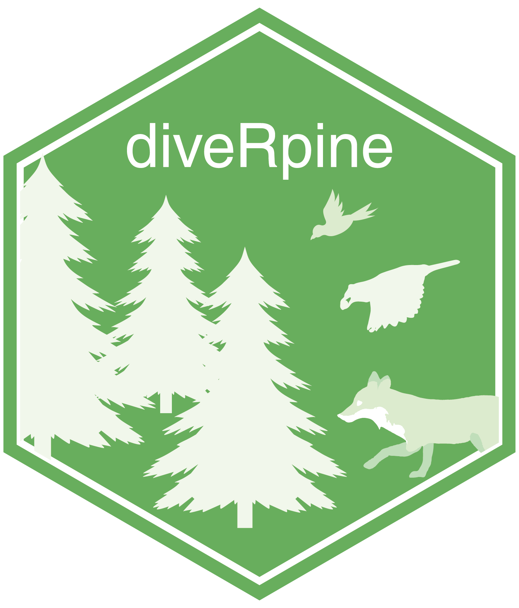

# `diveRpine` 

<p align="rigth">

</p>

<br>
<br>
diveRpine (**dive**rsification of **pine** plantations in Mediterranean mountains) is an interactive **R** tool to help forest-decision makers, which simulates the way in which species diversity in pine plantations varies depending on the landscape configuration, the internal structure of the plantation (*e.g.* past land uses, tree density), and the composition of the dispersion vectors (*e.g.* birds, mammals). 
<br>
<br>
The aim of the application is to develop a decision-support tool that simulates the dynamics of forest ecological processes. The application projects the most likely ecological succession in each stand based on the ecological context, and visualizes the relative importance of the different ecological mechanisms involved in the process. The resulting simulations help the manager to identify forest stands that most need intervention (active restoration), compared to other stands where intervention is unneeded (passive restoration), depending on the ecosystem services that the manager wishes to maximize. It also allows the user to visualize some of the complex ecological processes that underlie the diversification of pine plantations in Mediterranean mountain areas.

This tool uses information published in scientific journals in a synthetic and straightforward way, enabling the manager to visualize different scenarios and perform simulations based on solid field data interpreted in scientific contexts.

See a running example here.

## Prerequisites for using diveRpine
diveRpine was built in [R](https://www.r-project.org), an open source programming language using the [Shiny package](https://shiny.rstudio.com), a web application framework for R. 

Users will need to download [R](https://cran.uni-muenster.de/) in order to use diveRpine and we suggest the use of [RStudio](https://www.rstudio.com). 

## Installation 

``` r
library(devtools)
install_github("ajpelu/diveRpine")
```


All required code can be found in this github repositroy.


<!-- badges: start -->
  [](https://travis-ci.org/ajpelu/diveRpine)
  <!-- badges: end -->


- repostatus.org
- rstudio.mirror downloads
- cran version


