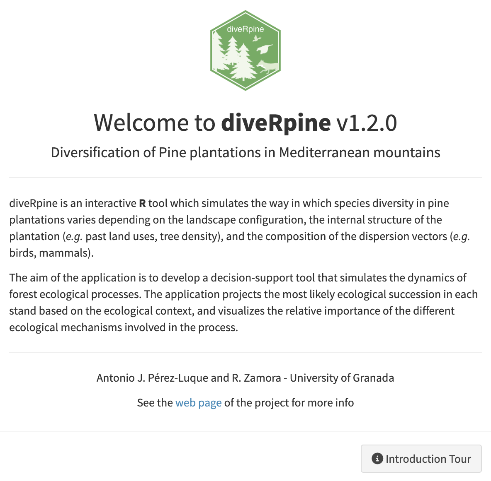

```{r, include = FALSE, echo=FALSE, warning=FALSE, message=FALSE}
knitr::opts_chunk$set(
  collapse = TRUE,
  comment = "#>"
)
library(diveRpine)
library(tidyverse)
library(raster)
library(landscapeR)
library(knitr)
library(kableExtra)
```


This is a getting started guide to run diveRpine shiny app. It contains how to run diveRpine in the default mode, both locally and remote.

## Run the `diveRpine` app 
There are several ways to run the `diveRpine` app:

* **Locally**. This is the recommended option to use the application. Download the package `diveRpine` and run it locally (the use of Rstudio is recommended). Steps: 

  1. Download and install the `diveRpine` pkg using:
  
  ```r
  # install.packages("remotes")
  remotes::install_github("ajpelu/diveRpine")
  ```
  
  2. Run the app: 
  ```r
  library("diveRpine")
  run_diveRpine()
  ```

Then, diveRpine is launched with a brief introduction tutorial that could be skipped.

```{r out.width = '70%', echo = FALSE, eval=FALSE}

```


* **Online**. Using the shiny app deposited  [here](http://vlab.iecolab.es/ajpelu/diveRpine_app/).

